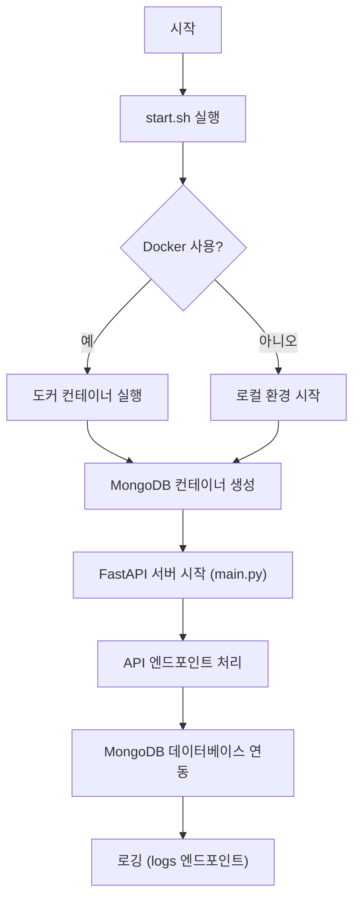
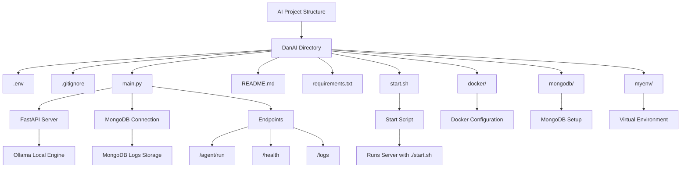

# DanAI Project Structure & Workflow

## 📌 Project Overview
DanAI는 FastAPI와 MongoDB를 기반으로 한 서버 애플리케이션으로, Docker를 활용한 컨테이너화 환경을 지원합니다. `start.sh` 스크립트를 통해 개발 서버를 실행하고, `.env` 파일을 통해 환경 변수를 관리합니다.

---

## 🧱 Technology Stack
- **Backend Framework**: [FastAPI](https://fastapi.tiangolo.com/)
- **Database**: [MongoDB](https://www.mongodb.com/)
- **Containerization**: [Docker](https://www.docker.com/)
- **Runtime**: Python 3.8+

---

## 📁 Directory Structure
```
DanAI/
├── .env              # 환경 변수 설정 파일
├── main.py           # FastAPI 애플리케이션 핵심 로직
├── Modelfile         # 모델 정의 파일 (LLM 관련)
├── README.md         # 프로젝트 개요 및 실행 방법
├── requirements.txt  # Python 의존성 파일
├── start.sh          # 서버 실행 스크립트
├── docker/           # Dockerfile 및 컨테이너 구성 파일
├── mongodb/          # MongoDB 관련 설정 및 스크립트
└── myenv/            # 가상 환경 파일 (venv)
```

---

## 🔄 Workflow Diagram (Mermaid)


---

## 📋 Detailed Workflow
1. **환경 설정**  
   - `.env` 파일에서 환경 변수 로드 (DB 연결 정보, 포트 등)
   - `requirements.txt` 기반으로 Python 패키지 설치

2. **서버 실행**  
   - `./start.sh` 명령어 실행
   - Docker 사용 시: `docker-compose up` 또는 `docker run` 명령어로 컨테이너 실행
   - 로컬 실행 시: `uvicorn main:app --reload` 명령어로 FastAPI 서버 실행

3. **애플리케이션 동작**  
   - 클라이언트 요청 → FastAPI 라우터 처리 → MongoDB 데이터베이스 연동
   - `/logs` 엔드포인트를 통해 서버 로그 확인 가능

4. **테스트 및 디버깅**  
   - `docker logs` 명령어로 컨테이너 로그 확인
   - `pdb` 또는 `pytest`를 사용한 단위 테스트 수행

5. **종료**  
   - `Ctrl+C`로 서버 중지
   - Docker 컨테이너는 `docker stop` 명령어로 종료



    